<!-- SECTIONS:API,CLI,WEBUI,CI,DOCKER,TESTS -->

# Project Overview | Insanely Fast Whisper API (ROCm)

A comprehensive Whisper-based speech recognition toolkit designed specifically to provide **AMD GPU (ROCm v6.4.1 & v7.1) support** for high-performance Automatic Speech Recognition (ASR) and translation. This package extends the capabilities of the original [insanely-fast-whisper](https://github.com/Vaibhavs10/insanely-fast-whisper) by providing multiple interfaces, ROCm compatibility, and production-ready architecture.

> [!NOTE]
> This overview is the **single source of truth** for developers working on this codebase.

[](https://www.python.org)
[](#version-summary)
[](#api-server-details)
[](#cli-command-line-interface-details)
[](#webui-gradio-interface-details)
[](LICENSE.txt)

---

## Table of Contents

- [Quickstart for Developers](#quickstart-for-developers)
- [Version Summary](#version-summary)
- [Project Features](#project-features)
- [Project Structure](#project-structure)
- [Architecture Highlights](#architecture-highlights)
- [Filename Conventions](#filename-conventions)
- [Configuration System](#configuration-system)
- [Application Interfaces](#application-interfaces)
  - [API Server Details](#api-server-details)
  - [WebUI (Gradio Interface) Details](#webui-gradio-interface-details)
  - [CLI (Command Line Interface) Details](#cli-command-line-interface-details)
- [SRT Formatting Pipeline Architecture](#srt-formatting-pipeline-architecture)
- [Performance Benchmarking](#performance-benchmarking)
- [Dependency Management](#dependency-management-with-pdm)
- [Error Handling](#error-handling)
- [Development Guidelines](#development-guidelines)
- [Deployment Options](#deployment-options)
- [Monitoring & Security](#monitoring--security)
- [Import Standardization](#import-standardization)

---

## Quickstart for Developers

```bash
# Clone and activate
git clone https://github.com/beecave-homelab/insanely-fast-whisper-rocm.git
cd insanely-fast-whisper-rocm
```

**Use Docker (recommended):**

```bash
# Create your user configuration file (interactive)
python scripts/setup_config.py

docker compose -f docker-compose.dev.yaml up --build -d
```

**Or run locally with PDM (for development):**

```bash
# Install PDM (if not already installed)
curl -sSL https://pdm-project.org/install-pdm.py | python3 -

# Install project dependencies (including dev and rocm groups)
pdm install -G rocm-7-1,bench,dev

# Activate the PDM-managed environment (optional, PDM handles it)
# pdm shell

# Choose your interface (run via PDM):
pdm run api                # API Server
pdm run api-debug          # API Server (verbose)
pdm run webui              # WebUI Interface
pdm run webui-debug        # WebUI Interface (debug)
pdm run cli transcribe audio.mp3  # CLI
```

---

## Version Summary

### 🏷️ **Current Version: v2.1.3** *(13-01-2026)*

**Latest improvements**: WebUI payload optimization to prevent frontend hangs, improved type hints and exception handling, reduced log verbosity, Dockerfile simplification, and dependency updates.

### 📊 **Release Overview**

| Version | Date | Type | Key Features |
| ------- | ---- | ---- | ------------ |
| **v2.1.3** | 13-01-2026 | 🐛 Patch | WebUI payload optimization, type hints, logging, Dockerfile simplification |
| **v2.1.2** | 10-01-2026 | 🐛 Patch | PyTorch allocator auto-config, timestamp fixes, log improvements, ROCm deps |
| **v2.1.1** | 02-01-2026 | 🐛 Patch | CLIFacade orchestrator fix, dependency updates, ROCm v7.1 docs |
| **v2.1.0** | 31-12-2025 | ✨ Minor | OOM orchestration + CPU fallback, GPU cache invalidation, added core OOM tests |
| **v2.0.1** | 08-12-2025 | 🐛 Patch | PR #27 fixes: audio conversion fallback, segment mutation, SRT counting, task params |
| **v2.0.0** | 05-12-2025 | 🔄 Major | Modular package refactor, package/CLI rename, model caching & readable subtitles |
| **v1.0.2** | 05-12-2025 | 🐛 Patch | API routes param fix, dead code removal, TDD tests |
| **v1.0.1** | 04-12-2025 | 🐛 Patch | WebUI ZIP summary fix, benchmarking refinements, local CI + workflow tooling |
| **v1.0.0** | 18-09-2025 | 🔄 Major | Timestamp merge fix; Breaking API for `split_audio()` and `merge_chunk_results()` |
| **v0.10.0** | 23-07-2025 | ✨ Minor | M4A support & Stable-TS integration |
| v0.9.1 | 19-07-2025 | 🐛 Patch | Translation & model override fixes |
| **v0.8.0** | Jul 2025 | ✨ Minor | Entrypoint refactoring, CLI export formats, translation feature |
| **v0.7.0** | Jun 2025 | ✨ Minor | Major import refactor, `pdm` migration, modular CLI |
| **v0.4.1** | Jun 2025 | 🐛 Patch | WebUI download fixes, stability |
| **v0.4.0** | Jun 2025 | ✨ Minor | Versioning improvements, logging enhancements |
| **v0.3.1** | Jun 2025 | 🐛 Patch | ZIP fixes, audio validation, stability |
| **v0.3.0** | May 2025 | ✨ Minor | WebUI modularization, batch processing |
| **v0.2.1** | May 2025 | ♻️ Minor | Import standardization, core refinements |
| **v0.2.0** | May 2025 | 🔄 Major | Breaking: Hugging Face direct integration |
| **v0.1.2** | Mar 2025 | ✨ Minor | First WebUI introduction |
| **v0.1.1** | Jan 2025 | 🔧 Minor | Enhanced functionality, logging |
| **v0.1.0** | Jan 2025 | 🎉 Major | Initial Release: FastAPI wrapper |

### 📈 **Development Stats**

- **100+ commits** across 5 months of development
- **3 major architectural refactors**
- **1 breaking change** (v0.2.0)

---

> 📖 **For complete version history, changelog, and detailed release notes, see [VERSIONS.md](VERSIONS.md)**
>
> **Note:** As of 2025-07-06, all release tags (v0.1.0 ... v0.9.0) have normalized commit mappings. The canonical mapping for each release is now found in VERSIONS.md under the 'Key Commits' section.

---

## Project Features

### Primary Focus: ROCm Support

- **AMD GPU (ROCm v6.4.1 & v7.1) Support**: First-class AMD GPU acceleration for Whisper models, tested with PyTorch 2.7.1+rocm7.1.0 and torchaudio 2.7.1+rocm7.1.0

- **Extended Original Package**: Builds upon [insanely-fast-whisper](https://github.com/Vaibhavs10/insanely-fast-whisper) with additional interfaces and ROCm compatibility
- **Production-Ready Architecture**: Beyond CLI-only approach of original package

### Core Capabilities

- **Transcription**: Audio to text in source language
- **Translation**: Audio to English
- **Native SDPA Acceleration**: Hugging Face `sdpa` attention implementation for faster processing on compatible hardware.
- **Readable Subtitles (SRT/VTT)**: A new segmentation pipeline that creates well-formed, readable subtitles by default. This feature respects line length, duration, and characters-per-second (CPS) constraints to produce professional-quality subtitles. It can be toggled with the `USE_READABLE_SUBTITLES` environment variable.
- **Word-level Timestamp Stabilization**: Optional integration with [`stable-ts`](https://github.com/jianfch/stable-ts). Enable via `--stabilize` (CLI) or corresponding API/WebUI options to obtain refined word-aligned segments.
- **Video & Audio Formats**: Support for standard audio files (.wav, .flac, .mp3, .m4a) **and** popular video containers (.mp4, .mkv, .webm, .mov) via automatic audio extraction with FFmpeg
- **Filename Standardization**: Predictable and configurable output naming

### Interface Options

- **FastAPI Server**: RESTful API with OpenAI-compatible v1 endpoints (`/v1/audio/transcriptions`, etc.)

- **Gradio WebUI**: Batch file upload, live progress tracking, ZIP downloads
- **CLI Interface**: Command-line tool for single-file processing
- **Model Management**: Automatic Hugging Face model downloading and caching
- **Docker Support**: Full containerization with development and production configurations
- **Direct Hugging Face Integration**: Native `transformers.pipeline` support
- **Configurable Processing**: Batch size, device, model selection
- **ROCm Integration**: Optimized PyTorch and ONNX runtime configurations for AMD GPUs
- **Native Attention Acceleration**: Uses `attn_implementation="sdpa"` for optimized performance without requiring `BetterTransformer`.

### Architecture

- **Modular Design**: Split core, audio, API, CLI, WebUI, and utils
- **Error Handling**: Layered, type-specific, with full trace logging
- **Native SDPA Acceleration vs. BetterTransformer**: This project uses the native Scaled Dot Product Attention (SDPA) available in PyTorch 2.0+ and `transformers` as its primary method for accelerating the Whisper model's attention mechanism. This is achieved by setting `attn_implementation="sdpa"` when loading the model.
- **OOM Recovery Orchestration (GPU -> CPU fallback)**: The core transcription path is wrapped by an OOM-aware orchestrator ([`core/orchestrator.py`](insanely_fast_whisper_rocm/core/orchestrator.py)) that implements deterministic recovery actions:

---

## Project Structure

```md
➜  insanely-fast-whisper-rocm git:(dev) ✗ scripts/exa_codebase_tree.sh insanely_fast_whisper_rocm 
insanely_fast_whisper_rocm
├── __init__.py
├── __main__.py
├── api
│  ├── __init__.py
│  ├── __main__.py
│  ├── app.py
│  ├── dependencies.py
│  ├── middleware.py
│  ├── models.py
│  ├── responses.py
│  └── routes.py
├── audio
│  ├── __init__.py
│  ├── conversion.py
│  ├── processing.py
│  └── results.py
├── benchmarks
│  ├── __init__.py
│  └── collector.py
├── cli
│  ├── __init__.py
│  ├── __main__.py
│  ├── cli.py
│  ├── commands.py
│  ├── common_options.py
│  ├── errors.py
│  ├── facade.py
│  └── progress_tqdm.py
├── core
│  ├── __init__.py
│  ├── asr_backend.py
│  ├── backend_cache.py
│  ├── cancellation.py
│  ├── errors.py
│  ├── formatters.py
│  ├── integrations
│  │  ├── __init__.py
│  │  └── stable_ts.py
│  ├── oom_utils.py
│  ├── orchestrator.py
│  ├── pipeline.py
│  ├── progress.py
│  ├── segmentation.py
│  ├── storage.py
│  └── utils.py
├── logging_config.yaml
├── main.py
├── utils
│  ├── __init__.py
│  ├── benchmark.py
│  ├── constants.py
│  ├── download_hf_model.py
│  ├── env_loader.py
│  ├── file_utils.py
│  ├── filename_generator.py
│  ├── format_time.py
│  ├── formatting.py
│  ├── srt_quality.py
│  └── timestamp_utils.py
└── webui
   ├── __init__.py
   ├── __main__.py
   ├── app.py
   ├── errors.py
   ├── handlers.py
   ├── merge_handler.py
   ├── ui.py
   ├── utils.py
   └── zip_creator.py
   
```

---

## Architecture Highlights

### Native SDPA Acceleration vs. BetterTransformer

This project uses the native Scaled Dot Product Attention (SDPA) available in PyTorch 2.0+ and `transformers` as its primary method for accelerating the Whisper model's attention mechanism. This is achieved by setting `attn_implementation="sdpa"` when loading the model.

**Why SDPA?**

- **Modern Standard**: SDPA is the official, built-in acceleration method in PyTorch. It is the successor to older, patch-based approaches like Hugging Face's `BetterTransformer`.
- **Performance**: It provides significant speed improvements for attention-heavy models like Whisper, often matching or exceeding the performance of `BetterTransformer`.
- **Simplicity**: As a native feature, it doesn't require an extra dependency like `optimum` or manual model patching (`BetterTransformer.transform(model)`). Integration is cleaner and more robust.

The codebase automatically enables `sdpa` for any GPU-based device (`cuda`, `mps`) and disables it for CPU, ensuring optimal performance where available without manual configuration. `sdpa` is the current and recommended acceleration method.

### OOM Recovery Orchestration (GPU -> CPU fallback)

The core transcription path is wrapped by an OOM-aware orchestrator ([`core/orchestrator.py`](insanely_fast_whisper_rocm/core/orchestrator.py)) that implements deterministic recovery actions:

- First `InferenceOOMError`: retry on GPU with batch size halved (down to `MIN_BATCH_SIZE`).
- Subsequent GPU OOMs, or any `ModelLoadingOOMError`: switch to CPU (`dtype=float32`, `batch_size<=2`, `chunk_length<=15`) and invalidate cached GPU backends via [`invalidate_gpu_cache()`](insanely_fast_whisper_rocm/core/backend_cache.py).
- Each attempt is recorded in `result["orchestrator_attempts"]` for UI/API visibility.

The OOM signatures are parsed for CUDA/HIP/ROCm in [`core/oom_utils.py`](insanely_fast_whisper_rocm/core/oom_utils.py) and exercised in unit tests under `tests/core/`.

---

## Filename Conventions

**Pattern:** `{audio_stem}_{task}_{timestamp}.{extension}`

| Part | Meaning |
| ---- | ------- |
| `audio_stem` | Original filename without extension |
| `task` | `transcribe` or `translate` |
| `timestamp` | ISO 8601 format. Ends with 'Z' for UTC, or a UTC offset (e.g., `+0200`) for local/specific timezones. Format: `YYYYMMDDTHHMMSS[Z\|+HHMM\|-HHMM]` |
| `extension` | `json`, `txt`, or `srt` |

### Example

```txt
# Example with UTC (default)
interview_audio_translate_20250601T091234Z.txt

# Example with APP_TIMEZONE=Europe/Amsterdam (assuming +02:00 offset)
interview_audio_translate_20250609T212928+0200.txt
```

Environment override for `TZ` (internally `APP_TIMEZONE`):

```bash
# TZ: Controls the timezone for timestamps in output filenames.
# This environment variable is read by the application and mapped to APP_TIMEZONE.
# Accepts:
#   "UTC" (default): Timestamps are in UTC, ending with 'Z'.
#   "local": Timestamps use the system's local timezone, ending with the local UTC offset (e.g., +0200).
#   IANA timezone string (e.g., "Europe/Amsterdam", "America/New_York"): Timestamps use the specified timezone,
#                          ending with its UTC offset.
TZ=Europe/Amsterdam
```

---

## Configuration System

### Configuration Files & Loading

The application uses a hierarchical approach for loading `.env` files, managed by [insanely_fast_whisper_rocm/utils/env_loader.py](insanely_fast_whisper_rocm/utils/env_loader.py) and accessed via [insanely_fast_whisper_rocm/utils/constants.py](insanely_fast_whisper_rocm/utils/constants.py).

1. **Project `.env`**: Located at the project root (e.g., `/path/to/project/.env`). This file can define project-specific defaults.
2. **User-specific `.env`**: Located at `~/.config/insanely-fast-whisper-rocm/.env`. This file is for user-specific overrides and sensitive information (like API keys).

**Loading Order & Override:**

- The project root `.env` is loaded first.
- The user-specific `~/.config/insanely-fast-whisper-rocm/.env` is loaded second and **will override** any variables previously set by the project `.env` or system environment variables.

**Key Configuration Files:**

- **[setup script](scripts/setup_config.py)**: A template file in the project root. Users should copy this to create their configuration files.
- **`~/.config/insanely-fast-whisper-rocm/.env`**: The primary user-specific configuration file. This is the recommended place for all user customizations.
- **Project `.env`** (Optional): Can be used for development-specific settings or non-sensitive project defaults.
- **[insanely_fast_whisper_rocm/utils/constants.py](insanely_fast_whisper_rocm/utils/constants.py)**: Defines and provides centralized access to all configuration variables after they are loaded from the environment and `.env` files. This includes the `USE_READABLE_SUBTITLES` flag, which defaults to `true`.
- **[insanely_fast_whisper_rocm/utils/env_loader.py](insanely_fast_whisper_rocm/utils/env_loader.py)**: Contains the logic for loading `.env` files hierarchically and managing debug print statements based on `LOG_LEVEL` or CLI flags.
- **[logging_config.yaml](insanely_fast_whisper_rocm/logging_config.yaml)**: Configures the application's logging behavior.

**User Configuration Setup Script:**

A utility script [`scripts/setup_config.py`](scripts/setup_config.py) is provided to help users create their user-specific configuration file. It copies the project's `.env.example` file to `~/.config/insanely-fast-whisper-rocm/.env`.

The script performs the following actions:

- Checks if `.env.example` exists in the project root.
- Creates the `~/.config/insanely-fast-whisper-rocm/` directory if it doesn't already exist.
- Copies `.env.example` to `~/.config/insanely-fast-whisper-rocm/.env`.
- Prompts the user for confirmation if a configuration file already exists at the destination, to prevent accidental overwrites.
- Informs the user to edit the newly created file to input their specific settings, such as `HF_TOKEN` for gated models.

Refer to the `.env.example` file in the project root for a comprehensive list of all available configuration options and their descriptions (e.g., model settings, device selection, file handling parameters, timezone configuration).

Run it using PDM:

```bash
pdm run setup-config
```

Or directly:

```bash
python scripts/setup_config.py
```

**Important**: No direct `os.getenv()` calls should be made outside of [insanely_fast_whisper_rocm/utils/env_loader.py](insanely_fast_whisper_rocm/utils/env_loader.py) or [insanely_fast_whisper_rocm/utils/constants.py](insanely_fast_whisper_rocm/utils/constants.py) to ensure consistent configuration loading.

### PyTorch Allocator Configuration (Automatic Version Detection)

The application implements automatic detection and configuration of PyTorch's memory allocator based on the installed PyTorch version. This is critical for ROCm/AMD GPU support because PyTorch 2.9.0+ renamed the allocator configuration environment variable.

**Background:**

- **PyTorch < 2.9.0**: Uses `PYTORCH_HIP_ALLOC_CONF` for ROCm memory allocation settings
- **PyTorch >= 2.9.0**: Uses `PYTORCH_ALLOC_CONF` (the variable was renamed and `PYTORCH_HIP_ALLOC_CONF` was deprecated)

**Implementation Details:**

The automatic detection logic is implemented in [insanely_fast_whisper_rocm/utils/constants.py](insanely_fast_whisper_rocm/utils/constants.py):

- **Version Detection**:
  - Uses `importlib.util.find_spec("torch")` to check if torch is installed
  - Retrieves the torch version using `pkg_version("torch")`
  - Parses the version string to extract major and minor version numbers

- **Environment Variable Selection**:

```python
if (major, minor) >= (2, 9):
    os.environ["PYTORCH_ALLOC_CONF"] = _pytorch_alloc_conf
else:
    os.environ["PYTORCH_HIP_ALLOC_CONF"] = _pytorch_alloc_conf
```

- **Fallback Handling**:
  - If torch is not yet installed (e.g., during initial setup), both environment variables are set for backward compatibility
  - If version metadata is unavailable, defaults to the newer `PYTORCH_ALLOC_CONF`

- **Configuration Loading Order**:
  - Checks `PYTORCH_ALLOC_CONF` first
  - Falls back to `PYTORCH_HIP_ALLOC_CONF` if the first is not set
  - Applies default configuration if neither is set: `garbage_collection_threshold:0.7,max_split_size_mb:128`

**User Configuration:**

Users can customize the allocator configuration in their `.env` file:

```bash
# For PyTorch 2.9.0+ (recommended)
PYTORCH_ALLOC_CONF=garbage_collection_threshold:0.7,max_split_size_mb:128

# For PyTorch < 2.9.0 (legacy)
PYTORCH_HIP_ALLOC_CONF=garbage_collection_threshold:0.7,max_split_size_mb:128
```

**VRAM Tuning:**

The `max_split_size_mb` parameter can be adjusted based on available GPU memory:

- **4GB VRAM**: `max_split_size_mb:64`
- **8GB-16GB VRAM**: `max_split_size_mb:128` (default)
- **24GB+ VRAM**: `max_split_size_mb:256` or `max_split_size_mb:512`

**Logging:**

The application logs the detected PyTorch version and which environment variable is being set at startup:

```text
INFO - PyTorch 2.9.1 detected: using PYTORCH_ALLOC_CONF
```

This provides visibility into the automatic configuration process and helps with debugging.

**Benefits:**

- **No Manual Configuration**: Users don't need to adjust their `.env` files when switching between ROCm versions
- **Deprecation Warning Elimination**: Prevents the `PYTORCH_HIP_ALLOC_CONF is deprecated` warning in PyTorch 2.9.0+
- **Backward Compatibility**: Works seamlessly with both old and new PyTorch versions
- **Flexible Override**: Users can still manually set either variable if needed for specific use cases

---

## Application Interfaces

This project provides multiple interfaces for interacting with the transcription and translation capabilities.

### API Server Details

The FastAPI server provides a robust and scalable way to integrate the speech recognition functionalities into other applications or services.

**Launch Options:**

You can start the API server with various options to customize its behavior:

```bash
# Launch with default settings (http://0.0.0.0:8000, port: 8000, workers: 1, log-level: info)
python -m insanely_fast_whisper_rocm.api

# See all available options and help
python -m insanely_fast_whisper_rocm.api --help

# Launch with a custom port
python -m insanely_fast_whisper_rocm.api --port 8001

# Launch with a custom host and port
python -m insanely_fast_whisper_rocm.api --host 127.0.0.1 --port 9000

# Launch with multiple workers (disables reload)
python -m insanely_fast_whisper_rocm.api --workers 4 --no-reload

# Launch with auto-reload enabled (for development)
python -m insanely_fast_whisper_rocm.api --reload

# Launch with a specific log level (e.g., debug)
python -m insanely_fast_whisper_rocm.api --log-level debug

# Launch in debug mode (enables debug logging for app and Uvicorn)
python -m insanely_fast_whisper_rocm.api --debug

# Launch with SSL (ensure dummy.key and dummy.crt exist or provide paths)
# python -m insanely_fast_whisper_rocm.api --ssl-keyfile dummy.key --ssl-certfile dummy.crt
```

**API Parameters:**

The API endpoints have distinct parameters. Core model settings (`model`, `device`, `batch_size`, etc.) are configured globally through environment variables and cannot be changed per-request.

- `/v1/audio/transcriptions`:
  - `file`: The audio file to transcribe (required).
  - `response_format`: The desired output format (`json`, `verbose_json`, `text`, `srt`, `vtt`). Defaults to `json`.
  - `timestamp_type`: The granularity of the timestamps (`chunk` or `word`). Defaults to `chunk`.
  - `language`: The language of the audio. If omitted, the model will auto-detect the language.
  - `stabilize`: `bool` - Enable timestamp stabilization using `stable-ts`. Defaults to `False`.
  - `demucs`: `bool` - Enable Demucs noise reduction before transcription. Defaults to `False`.
  - `vad`: `bool` - Enable Silero VAD to filter out silent parts of the audio. Defaults to `False`.
  - `vad_threshold`: `float` - The threshold for VAD. Defaults to `0.35`.
- `/v1/audio/translations`:
  - `file`: The audio file to translate (required).
  - `response_format`: The desired output format (`json`, `verbose_json`, `text`, `srt`, `vtt`). Defaults to `json`.
  - `stabilize`: `bool` - Enable timestamp stabilization using `stable-ts`. Defaults to `False`.
  - `demucs`: `bool` - Enable Demucs noise reduction before transcription. Defaults to `False`.
  - `vad`: `bool` - Enable Silero VAD to filter out silent parts of the audio. Defaults to `False`.
  - `vad_threshold`: `float` - The threshold for VAD. Defaults to `0.35`.
  - `timestamp_type`: The granularity of the timestamps (`chunk` or `word`). Defaults to `chunk`.
  - `language`: The language of the audio. If omitted, the model will auto-detect the language.

### WebUI (Gradio Interface) Details

The Gradio WebUI offers an interactive, browser-based experience—ideal for batch processing multiple audio/video files—and now **parity with the CLI for advanced audio-preprocessing features**:

- **Word-level timestamp stabilization** (`--stabilize`, powered by stable-ts)
- **Demucs noise reduction** (`--demucs`)
- **Voice Activity Detection** (`--vad`, with adjustable `--vad-threshold`)

**Launch Options:**

```bash
# Basic WebUI launch
python -m insanely_fast_whisper_rocm.webui

# With debug logging (recommended for development or troubleshooting)
python -m insanely_fast_whisper_rocm.webui --debug

# Custom host and port
python -m insanely_fast_whisper_rocm.webui --port 7860 --host 0.0.0.0 --debug
```

### CLI (Command Line Interface) Details

#### Internal Refactor (v0.9.2)

The CLI codebase was streamlined to eliminate hundreds of lines of duplicated `click` option declarations.

- **`cli/common_options.py`** now exposes an `audio_options` decorator that injects all shared flags (model, device, batch-size, language, export settings, etc.) into any command.
- **`cli/commands.py`** was rewritten so that `transcribe` and `translate` are *thin wrappers*:

  ```python
  @click.command(short_help="Transcribe an audio file")
  @audio_options
  def transcribe(audio_file: Path, **kwargs):
      _run_task(task="transcribe", audio_file=audio_file, **kwargs)
  ```

- The business logic lives in `_run_task`, and helpers such as `_handle_output_and_benchmarks` keep the file organized.

- New flag: `--stabilize` (timestamp post-processing via stable-ts).

Nothing changes for end-users — option names and behaviour remain the same — but the code is far easier to maintain and extend.

#### Performance Benchmarking

Use the `--benchmark` flag to measure processing speed and collect hardware stats.

> **Install dependencies**: Benchmarking relies on optional packages (`psutil`, `pyamdgpuinfo`, etc.). Install them with:
>
> ```bash
> pdm install -G bench
> ```

```bash
# Quick benchmark (writes benchmark JSON; transcript export is unchanged by --benchmark)
python -m insanely_fast_whisper_rocm.cli transcribe audio.mp3 --benchmark

# Benchmark and also export transcript as TXT
python -m insanely_fast_whisper_rocm.cli transcribe audio.mp3 --benchmark --export-format txt

# Pass arbitrary metadata
python -m insanely_fast_whisper_rocm.cli transcribe audio.mp3 --benchmark --benchmark-extra precision=fp16 tokenizer=fast
```

**Key behaviors**:

| Feature | Description |
| ------- | ----------- |
| Transcript export behavior | Unchanged by `--benchmark`; exports follow `--export-format` (default: `json`). |
| Timestamps | Unchanged by `--benchmark`; controlled by `--no-timestamps` and `--timestamp-type`. |
| Output location | A JSON file is written to `benchmarks/` with name pattern `benchmark_<audio>_<task>_<timestamp>.json`. |
| Extra metadata | Use repeated `--benchmark-extra key=value` pairs to inject custom fields into the JSON. |
| Completion message | The benchmark path is printed **at the end** of the CLI output (📈 line) for quick copy-paste. |

The JSON includes runtime stats, total elapsed time, system info (OS, Python, Torch version), and GPU metrics (VRAM, temperature, power for AMD/CUDA when available).

##### SRT Formatting Diagnostics

When benchmarking SRT outputs, `_handle_output_and_benchmarks()` stores a
`format_quality.srt` block generated by `compute_srt_quality()` in
`insanely_fast_whisper_rocm/utils/srt_quality.py`. The score ranges from 0.0 to
1.0, with penalties applied for:

- **Overlaps**: Any overlapping subtitles subtract a large fixed amount because
  they break readability.
- **Hyphen spacing**: Suspicious spacing around hyphenated words triggers a
  lightweight deduction.
- **Line length violations**: Proportional penalty based on how many lines
  exceed `constants.MAX_LINE_CHARS`.
- **Characters per second (CPS)**: Segments outside the configured
  `constants.MIN_CPS`–`constants.MAX_CPS` window lower the score proportionally.
- **Duration bounds**: A baseline penalty plus proportional deduction when
  segment durations fall outside
  `constants.MIN_SEGMENT_DURATION_SEC`–`constants.MAX_SEGMENT_DURATION_SEC`.

The `details` object explains every deduction so you can debug subtitles:

- **`duration_stats`**: Min/median/average/max segment lengths.
- **`boundary_counts`**: Number of segments deemed too short/long versus within
  range.
- **`cps_histogram`**: Counts of segments below, within, or above the CPS
  thresholds.
- **`sample_offenders`**: Representative examples for long lines and CPS
  outliers, including segment indices, timestamps, and offending text.

These diagnostics are consumed by both CLI tests (see
`tests/cli/test_cli_output_benchmarks.py`) and unit tests in
`tests/core/test_srt_quality.py`, ensuring regressions surface quickly and any
subtitle-quality issues can be traced back to specific segments.

---

The Command Line Interface is ideal for single-file processing, scripting, or quick tests. It supports multiple output formats and provides clear feedback on the transcription process.

#### Timestamp Stabilization (`--stabilize`)

Use `--stabilize` to refine timestamps with the [stable-ts](https://github.com/jianfch/stable-ts) library. When the flag is supplied, the CLI will post-process Whisper results via `stable_whisper.transcribe_any`, producing more reliable **word-level** timestamps while keeping chunk timings intact. The option works for both `transcribe` and `translate` commands and can be combined with any export or benchmarking settings.

#### Export Formats

The `--export-format` option controls the output file type. The following formats are available:

| Format | Description                                       | Output Directory      |
|--------|---------------------------------------------------|-----------------------|
| `json` | (Default) Standard JSON output with transcription | `transcripts/`        |
| `txt`  | Plain text                                        | `transcripts-txt/`    |
| `srt`  | SubRip subtitle format (requires timestamps)      | `transcripts-srt/`    |
| `all`  | Exports all three formats simultaneously          | (Respective above)    |

#### Command Examples and Options

```bash
# Transcribe and get a JSON file (default)
python -m insanely_fast_whisper_rocm.cli transcribe audio_file.mp3

# Transcribe and get a TXT file
python -m insanely_fast_whisper_rocm.cli transcribe audio_file.mp3 --export-format txt

# Transcribe and get all formats (JSON, SRT, TXT)
python -m insanely_fast_whisper_rocm.cli transcribe audio_file.mp3 --export-format all

# Translate and get an SRT file
python -m insanely_fast_whisper_rocm.cli translate audio_file.mp3 --export-format srt

# Transcribe with debug logging enabled
python -m insanely_fast_whisper_rocm.cli transcribe audio_file.mp3 --debug
```

Consult `python -m insanely_fast_whisper_rocm.cli --help` for a full list of commands and options.

---

## Debug Logging

Comprehensive DEBUG-level logging has been instrumented across the transcription pipeline to diagnose subtitle quality and performance issues.

### Enabling Debug Logging

**CLI:**

```bash
# Enable debug logging with --debug flag
python -m insanely_fast_whisper_rocm.cli transcribe audio.mp3 --debug
```

**Environment Variable:**

```bash
# Set LOG_LEVEL to DEBUG
export LOG_LEVEL=DEBUG
python -m insanely_fast_whisper_rocm.cli transcribe audio.mp3
```

### Instrumented Modules

Debug logging has been added to the following critical components:

1. **`cli/commands.py`** - Task inputs/outputs, facade calls, GPU stats, export formats, benchmark collection
2. **`cli/facade.py`** - Backend initialization, pipeline routing decisions, return payloads
3. **`core/pipeline.py`** - ASR execution params, chunk processing, merge results, postprocessing
4. **`core/asr_backend.py`** - Pipeline calls, raw outputs, normalized results
5. **`core/formatters.py`** - Word extraction heuristics, duration checks, quality segment building
6. **`core/segmentation.py`** - Word expansion, sanitization, sentence chunks, merge operations, CPS enforcement
7. **`benchmarks/collector.py`** - Benchmark parameters, format_quality keys, output paths

### What Gets Logged

At DEBUG level, you'll see:

- **Input/output summaries**: Text lengths, segment counts, word counts
- **Decision points**: Why word-level vs chunk-level data was chosen
- **Processing stages**: Number of items at each transformation step
- **Timing information**: Runtime at key stages
- **Quality metrics**: SRT quality scores, CPS calculations, segment durations

### Safe Logging Practices

All debug logging follows these principles:

- **Summarizes** large data structures (counts, sample entries) instead of full dumps
- **No PII**: Only logs counts, types, and structural information
- **Zero performance impact** when not enabled (standard Python logging behavior)
- **Non-breaking**: All tests pass with logging instrumentation in place

### Example Output

```text
DEBUG:insanely_fast_whisper_rocm.core.formatters:_result_to_words: examining result with chunks=True, segments=True
DEBUG:insanely_fast_whisper_rocm.core.formatters:Found 142 potential words from chunks, avg_duration=0.234s
DEBUG:insanely_fast_whisper_rocm.core.segmentation:segment_words: processing 142 input words
DEBUG:insanely_fast_whisper_rocm.core.segmentation:After expansion: 145 words
DEBUG:insanely_fast_whisper_rocm.core.segmentation:Split into 8 sentence chunks
DEBUG:insanely_fast_whisper_rocm.core.segmentation:Before merge_short_segments: 12 segments
DEBUG:insanely_fast_whisper_rocm.core.segmentation:After merge_short_segments: 10 segments
DEBUG:insanely_fast_whisper_rocm.core.segmentation:segment_words returning 10 final segments
```

---

## SRT Formatting Pipeline Architecture

This section provides a comprehensive guide for developers working on the SRT/VTT subtitle formatting pipeline. The pipeline transforms raw ASR word-level timestamps into professional, readable subtitle files that respect industry standards for duration, character limits, and reading speed.

### Overview

The SRT formatting pipeline consists of three main phases:

1. **Word Extraction & Normalization** - Extract and validate word-level timestamps from ASR output
2. **Segmentation & Readability Processing** - Apply linguistic and typographic rules to create readable captions
3. **Formatting & Output** - Convert segments to SRT/VTT format with proper timestamps

### Component Architecture

```mermaid
flowchart TD
    %% Input Stage
    ASR[ASR Backend<br/>core/asr_backend.py] -->|Raw Result| Pipeline[ASR Pipeline<br/>core/pipeline.py]
    Pipeline -->|result dict| Formatter[SrtFormatter.format<br/>core/formatters.py]
    
    %% Word Extraction Phase
    Formatter -->|Check USE_READABLE_SUBTITLES| WordExtract[_result_to_words<br/>core/formatters.py]
    WordExtract -->|Extract word timestamps| WordData{Word-level<br/>data available?}
    
    %% Segmentation Phase
    WordData -->|Yes: Word list| Segmentation[segment_words<br/>core/segmentation.py]
    WordData -->|No| Fallback[Chunk-based fallback<br/>+ validate_timestamps]
    
    %% Segmentation Steps
    Segmentation --> Expand[_expand_multi_token_words]
    Expand --> Sanitize[_sanitize_words_timing]
    Sanitize --> Sentence[_sentence_chunks<br/>Split on . ! ?]
    Sentence --> Clause[_split_at_clause_boundaries<br/>Split on commas]
    Clause --> Merge1[_merge_short_segments<br/>Combine short durations]
    Merge1 --> WordExp[_maybe_expand_single_word<br/>Expand single-word segments]
    WordExp --> CharLimits[_reapply_character_limits<br/>Enforce MAX_LINE_CHARS]
    CharLimits --> CPS[_enforce_cps<br/>MIN_CPS ≤ rate ≤ MAX_CPS]
    CPS --> Merge2[_merge_short_segments<br/>Final merging pass]
    Merge2 --> Monotonic[_ensure_monotonic_segments<br/>Fix timing order]
    Monotonic --> Wrap[split_lines<br/>2-line wrapping]
    
    %% Output Phase
    Wrap --> Segments[Segment list]
    Segments --> Format[Format SRT entries<br/>format_srt_time]
    Fallback --> TsValidate[validate_timestamps<br/>utils/timestamp_utils.py]
    TsValidate --> Format
    Format --> Output[Final SRT/VTT String]
    
    %% Configuration
    Constants[Configuration<br/>utils/constants.py] -.->|MAX_LINE_CHARS<br/>MAX_CPS<br/>MIN_SEGMENT_DURATION_SEC| Segmentation
    TimeFormat[format_time.py] -.->|format_srt_time<br/>format_vtt_time| Format
    
    %% Styling
    classDef primary fill:#4A90E2,stroke:#2E5C8A,stroke-width:2px,color:#fff
    classDef secondary fill:#50C878,stroke:#2E7D4E,stroke-width:2px,color:#fff
    classDef config fill:#F5A623,stroke:#C17B1A,stroke-width:2px,color:#fff
    classDef decision fill:#E94B3C,stroke:#A33327,stroke-width:2px,color:#fff
    
    class ASR,Pipeline,Formatter primary
    class Segmentation,Format secondary
    class Constants,TimeFormat config
    class WordData decision
```



### Component Responsibilities

#### 1. **core/formatters.py**

The entry point for SRT/VTT generation and quality segment building.

**Key Functions:**

- **`SrtFormatter.format(result)`** / **`VttFormatter.format(result)`**
  - Entry point for formatting transcription results
  - Checks `USE_READABLE_SUBTITLES` flag to enable/disable advanced pipeline
  - Routes to word-level or chunk-based processing
  - Applies hyphen normalization for better readability

- **`_result_to_words(result)`**
  - Extracts word-level timestamps from various ASR result formats
  - Supports both `chunks` and `segments` keys
  - Heuristic: Uses average duration < 1.5s to distinguish words from sentences
  - Returns `list[Word]` or `None`

- **`build_quality_segments(result)`**
  - Creates segments suitable for quality scoring and benchmarking
  - Uses segmentation pipeline when word timestamps available
  - Falls back to raw chunks/segments with validation

**Data Flow:**

```text
ASR Result → _result_to_words() → segment_words() → SRT formatting
```

**Interactions:**

- Calls `segment_words()` from `segmentation.py`
- Uses `split_lines()` for text wrapping
- Imports timestamp formatters from `utils/format_time.py`
- Validates timestamps via `utils/timestamp_utils.py` (fallback path)

#### 2. **core/segmentation.py**

The core segmentation engine that implements readability rules.

**Data Structures:**

```python
@dataclass
class Word:
    text: str
    start: float  # seconds
    end: float    # seconds

@dataclass
class Segment:
    text: str        # May contain \n for line breaks
    start: float
    end: float
    words: list[Word]
```

**Key Functions:**

| Function | Purpose | Input | Output |
| -------- | ------- | ----- | ------ |
| `segment_words()` | Orchestrates full pipeline | `list[Word]` | `list[Segment]` |
| `_expand_multi_token_words()` | Splits multi-word tokens | `list[Word]` | `list[Word]` |
| `_sanitize_words_timing()` | Enforces monotonic timing | `list[Word]` | `list[Word]` |
| `_sentence_chunks()` | Groups words into sentences | `list[Word]` | Generator of word lists |
| `_split_at_clause_boundaries()` | Splits on commas | `list[Word]` | `list[list[Word]]` |
| `_split_long_text_aggressively()` | Hard splits for length | `list[Word]` | `list[list[Word]]` |
| `_find_natural_split_points()` | Finds conjunctions/connectors | `list[Word]` | `list[int]` (indices) |
| `_merge_short_segments()` | Combines undersized segments | `list[Segment]` | `list[Segment]` |
| `_enforce_cps()` | Enforces reading speed limits | `list[Segment]` | `list[Segment]` |
| `_ensure_monotonic_segments()` | Final timing validation | `list[Segment]` | `list[Segment]` |
| `split_lines()` | Wraps text into ≤2 lines | `str` | `str` (with `\n`) |

**Processing Pipeline:**

```text
1. Expand multi-token words
2. Sanitize timing (monotonic, min duration)
3. Split into sentence chunks (. ! ?)
4. Split long sentences at commas/conjunctions
5. Merge short segments (< MIN_SEGMENT_DURATION_SEC)
6. Expand single-word segments for CPS
7. Re-apply character limits
8. Enforce CPS constraints (MIN_CPS to MAX_CPS)
9. Final merge pass
10. Ensure monotonic segment order
11. Apply line wrapping (split_lines)
```

**Interactions:**

- Reads configuration from `utils/constants.py`
- Called by `formatters.py` functions
- Uses natural language heuristics (SOFT_BOUNDARY_WORDS)

#### 3. **utils/constants.py**

Centralized configuration for all segmentation parameters.

**Subtitle Readability Constants:**

| Constant | Default | Description |
| -------- | ------- | ----------- |
| `USE_READABLE_SUBTITLES` | `true` | Master switch for advanced pipeline |
| `MAX_LINE_CHARS` | `42` | Maximum characters per line |
| `MAX_LINES_PER_BLOCK` | `2` | Maximum lines per subtitle block |
| `MAX_BLOCK_CHARS` | `84` | Hard limit for total block characters |
| `MAX_BLOCK_CHARS_SOFT` | `90` | Soft limit allowing flexibility |
| `MIN_CPS` | `8.0` | Minimum characters per second (reading speed) |
| `MAX_CPS` | `22.0` | Maximum characters per second (reading speed) |
| `MIN_SEGMENT_DURATION_SEC` | `0.9` | Minimum segment display time |
| `MAX_SEGMENT_DURATION_SEC` | `4.0` | Maximum segment display time |
| `MIN_WORD_DURATION_SEC` | `0.04` | Minimum word duration for sanitization |
| `SOFT_BOUNDARY_WORDS` | `and,but,or,so,for,nor,yet` | Preferred line break locations |

**Environment Variables:**

All constants can be overridden via `.env` files or environment variables:

```bash
# Example: Adjust CPS limits for faster-paced content
MAX_CPS=25.0
MIN_CPS=12.0

# Example: Longer segments for documentary-style content
MAX_SEGMENT_DURATION_SEC=6.0

# Example: Disable readable subtitles pipeline
USE_READABLE_SUBTITLES=false
```

**Interactions:**

- Imported by `segmentation.py` and `formatters.py`
- Loaded from `.env` files via `env_loader.py`
- Used throughout the codebase for consistency

#### 4. **utils/timestamp_utils.py**

Centralized timestamp validation and normalization utilities.

**Key Functions:**

- **`validate_timestamps(segments)`**
  - Sorts segments by start time
  - Fixes overlapping timestamps
  - Removes invalid segments
  - Used in fallback formatting path

- **`normalize_timestamp_format(data)`**
  - Converts between chunk/segment formats
  - Normalizes timestamp representations

- **`extract_timestamps(segment)`**
  - Extracts start/end from various formats
  - Handles both tuple and field-based timestamps

**Interactions:**

- Called by `formatters.py` in fallback path
- Used when word-level timestamps unavailable
- Ensures consistent timestamp handling

#### 5. **utils/format_time.py**

Time formatting utilities for subtitle timestamps.

**Key Functions:**

- **`format_srt_time(seconds: float) -> str`**
  - Converts seconds to SRT format: `HH:MM:SS,mmm`
  - Example: `90.5` → `00:01:30,500`

- **`format_vtt_time(seconds: float) -> str`**
  - Converts seconds to WebVTT format: `HH:MM:SS.mmm`
  - Example: `90.5` → `00:01:30.500`

**Interactions:**

- Imported by `formatters.py` for timestamp rendering
- Used in both SRT and VTT formatting paths

#### 6. **core/pipeline.py**

High-level ASR pipeline orchestration.

**Responsibilities:**

- Manages ASR backend lifecycle
- Coordinates audio preprocessing
- Invokes formatters for output generation
- Handles progress callbacks

**Interactions:**

- Creates ASR results passed to formatters
- Manages file I/O and storage
- Coordinates with `audio/` modules for preprocessing

### Data Flow Example

**Full Pipeline with Word-Level Timestamps:**

```text
1. ASR Backend (asr_backend.py)
   ↓ Raw ASR result with chunks/segments
   
2. Pipeline (pipeline.py)
   ↓ Routes to formatter
   
3. SrtFormatter.format() (formatters.py)
   ↓ Checks USE_READABLE_SUBTITLES=true
   
4. _result_to_words() (formatters.py)
   ↓ Extracts: [Word("Hello", 0.0, 0.5), Word("world", 0.5, 1.0), ...]
   
5. segment_words() (segmentation.py)
   ↓ Processes through 11-step pipeline
   
6. Output: list[Segment]
   ↓ Segment("Hello world", start=0.0, end=1.0, words=[...])
   
7. Format as SRT
   ↓ "1\n00:00:00,000 --> 00:00:01,000\nHello world\n"
   
8. Return final SRT string
```

**Fallback Path without Word Timestamps:**

```text
1. ASR Backend produces chunk-level only
   
2. _result_to_words() returns None
   
3. Fallback to chunks/segments
   
4. validate_timestamps() fixes overlaps
   
5. Direct SRT formatting with split_lines()
   
6. Return SRT string
```

### Customization Guide

#### Adjusting Character Limits

To change line length limits:

```python
# In .env or environment
MAX_LINE_CHARS=50  # Increase from 42
MAX_BLOCK_CHARS=100  # Increase proportionally
```

Or programmatically in tests:

```python
from unittest.mock import patch

with patch("insanely_fast_whisper_rocm.utils.constants.MAX_LINE_CHARS", 50):
    result = SrtFormatter.format(asr_result)
```

#### Modifying CPS (Reading Speed)

Industry standards: 12-17 CPS for adults, 8-12 CPS for children. Default: 8.0-22.0 CPS.

```bash
# For faster-paced technical content
MIN_CPS=12.0
MAX_CPS=25.0

# For accessibility/slower reading
MIN_CPS=6.0
MAX_CPS=14.0
```

#### Extending Split Logic

To add custom split points (e.g., semicolons):

1. Modify `_sentence_chunks()` in `segmentation.py`:

   ```python
   sentence_ends = {".", "!", "?", ";"}  # Add semicolon
   ```

2. Update `_split_at_clause_boundaries()` for custom clause markers
3. Add new boundary words to `SOFT_BOUNDARY_WORDS` in constants

#### Disabling Advanced Pipeline

To use simple chunk-based formatting:

```bash
USE_READABLE_SUBTITLES=false
```

This bypasses the entire segmentation pipeline and uses raw ASR chunks.

### Testing Considerations

When modifying segmentation logic:

1. **Test with word-level timestamps**

   ```python
   words = [Word("Test", 0.0, 0.5), Word("word", 0.5, 1.0)]
   segments = segment_words(words)
   ```

2. **Test edge cases:**

   - Zero/negative durations
   - Overlapping timestamps
   - Very long segments (> MAX_BLOCK_CHARS)
   - Single-word segments
   - Empty input

3. **Verify constraints:**

   - CPS within MIN_CPS to MAX_CPS
   - Duration within MIN_SEGMENT_DURATION_SEC to MAX_SEGMENT_DURATION_SEC
   - Line length ≤ MAX_LINE_CHARS
   - Max 2 lines per segment

4. **Test formatters with various inputs:**

   - Word-level data (chunks with short durations)
   - Sentence-level data (segments with long durations)
   - Missing timestamp data
   - stable-ts output format

### Performance Considerations

- **Word extraction heuristic**: Uses average duration to detect word vs sentence level (threshold: 1.5s)
- **Greedy CPS enforcement**: May create synthetic timing when original duration too short
- **Multiple merge passes**: Ensures optimal segment grouping
- **Line wrapping algorithm**: Exhaustive search for best split point

### Common Issues & Solutions

| Issue | Cause | Solution |
| ----- | ----- | -------- |
| Segments too long | MAX_SEGMENT_DURATION_SEC too high | Reduce in constants.py |
| Too many short segments | MIN_SEGMENT_DURATION_SEC too high | Decrease threshold |
| CPS violations | Unrealistic ASR timing | Enable timestamp stabilization (--stabilize) |
| Missing line breaks | Word timestamps unavailable | Ensure timestamp_type="word" |
| Overlapping timestamps | ASR backend issue | validate_timestamps() auto-corrects |

### Related Modules

- **`core/integrations/stable_ts.py`**: Timestamp stabilization for improved word alignment
- **`audio/processing.py`**: Audio preprocessing (VAD, Demucs) affects word timing quality
- **`cli/commands.py`**: CLI flags like `--stabilize` influence upstream word quality
- **`api/routes.py`**: API endpoints expose `timestamp_type` and stabilization options

---

### Quiet Mode (`--quiet`)

Use `--quiet` to minimize console output. In quiet mode, the CLI shows only:

- The Rich progress bar during processing (when attached to a TTY).
- The final lines indicating where files were saved (for example, `💾 Saved TXT to: …`).

All intermediate INFO logs and auxiliary messages are suppressed. When
timestamp stabilization is enabled (via `--stabilize`) and optional post-
processing is active (Demucs/VAD), quiet mode also suppresses third-party
progress bars and HIP/MIOpen warnings emitted by underlying libraries.

Notes:

- On non-TTY output (pipes/redirects), the Rich progress bar is disabled by
  design; quiet mode will still emit the final saved-path line(s).
- `--debug` overrides quiet suppression and will emit detailed logs.

Example:

```bash
# Only show the progress bar and the final saved path(s)
python -m insanely_fast_whisper_rocm.cli transcribe audio.mp3 \
  --model openai/whisper-small \
  --batch-size 12 \
  --export-format txt \
  --quiet
```

---

## Dependency Management with PDM

This project uses [PDM (Python Development Master)](https://pdm-project.org/) for dependency management and package building, adhering to PEP 517, PEP 518, and PEP 621 standards. All project metadata, dependencies, and scripts are defined in the [`pyproject.toml`](pyproject.toml) file.

### Torchaudio backend setup for stable-ts (SoundFile + libsndfile)

Some `stable-ts` code paths call `torchaudio.save(...)`. Minimal Docker images often lack a write-capable torchaudio backend by default, causing errors like:

```text
RuntimeError: Couldn't find appropriate backend to handle uri /path/file.wav and format None.
```

- **Install runtime dependencies**:
  - Python: `soundfile` (PySoundFile)
  - System: `libsndfile`
- **Prefer SoundFile backend**:

```bash
# In Dockerfile or environment
export TORCHAUDIO_USE_SOUNDFILE=1
```

This repository is configured accordingly:

- `Dockerfile.dev` installs `libsndfile1` and sets `TORCHAUDIO_USE_SOUNDFILE=1`.
- `pyproject.toml` declares `soundfile` as a dependency.
- `.env.example` documents `TORCHAUDIO_USE_SOUNDFILE` and cautions against forcing unsupported ROCm allocator modes.

Notes for ROCm users:

- Avoid `PYTORCH_HIP_ALLOC_CONF=expandable_segments:True` on stacks that do not support it; it can lead to stalls. Prefer leaving it unset or set `expandable_segments:False`.
- The ASR backend attempts `attn_implementation="sdpa"` first on ROCm and falls back to `"eager"` automatically if the load fails.

### [`pyproject.toml`](pyproject.toml) Structure

- **`[project]`**: Contains core project metadata such as name, version, authors, description, and classifiers.
  - **`dependencies`**: Lists core runtime dependencies required for the application to function.
  - **`optional-dependencies`**: Defines groups of dependencies that are not required for the core functionality but can be installed for specific purposes. Key groups include:
    - `dev`: Tools for development, such as linters (`ruff`), testing frameworks (`pytest`, `pytest-cov`), and other utilities.
    - `rocm-6-4-1`: Dependencies for AMD ROCm v6.4.1 GPU support, including PyTorch 2.5.0-2.8.0, torchaudio 2.5.0-2.8.0, onnxruntime-rocm, and pytorch-triton-rocm.
    - `rocm-7-1`: Dependencies for AMD ROCm v7.1 GPU support, including PyTorch 2.9.0-2.10.0, torchaudio 2.9.0, onnxruntime-rocm, and triton.
    - `bench`: Benchmarking utilities including `pyamdgpuinfo` for GPU metrics.

#### ROCm Version-Specific Dependency Groups

The project provides separate dependency groups for different ROCm versions to ensure compatibility:

- **`rocm-6-4-1`**: For ROCm 6.4.1 with PyTorch 2.5.0-2.8.0
  - Includes: `torch>=2.5.0,<2.8.0`, `torchaudio>=2.5.0,<2.8.0`, `onnxruntime-rocm`, `pytorch-triton-rocm>=3.2.0,<=3.3.1`

- **`rocm-7-1`**: For ROCm 7.1 with PyTorch 2.9.0-2.10.0
  - Includes: `torch>=2.9.0,<2.10.0`, `torchaudio==2.9.0`, `onnxruntime-rocm`, `triton>=3.2.0,<=3.5.1`

**Install ROCm dependencies:**

```bash
# For ROCm v6.4.1
pdm install -G rocm-6-4-1

# For ROCm v7.1
pdm install -G rocm-7-1

# For development with ROCm v7.1
pdm install -G rocm-7-1,bench,dev
```

- **`[tool.pdm]`**: Configures PDM-specific settings.
  - **`scripts`**: Defines shortcuts for common commands (e.g., `lint`, `format`, `test`, `api`, `webui`, `cli`). These can be run using `pdm run <script_name>`.
  - **`dev-dependencies`**: PDM's way to specify development-only dependencies, often mirrored or managed via the `dev` group in `optional-dependencies` for broader compatibility.

### PDM Setup and Installation

1. **Install PDM**: If you don't have PDM, install it globally or per-user. A common method is:

    ```bash
    curl -sSL https://pdm-project.org/install-pdm.py | python3 -
    ```

    Follow the instructions to add PDM to your PATH.

2. **Install Project Dependencies**: Navigate to the project root directory and run:

    ```bash
    pdm install
    ```

    By default, this installs core dependencies. To include optional groups:

    ```bash
    # Install core + development tools
    pdm install -G dev

    # Install core + ROCm v6.4.1 support
    pdm install -G rocm-6-4-1

    # Install core + development tools + ROCm v7.1 support
    pdm install -G dev -G rocm-7-1
    ```

    PDM creates a `.venv` directory for the virtual environment and a `pdm.lock` file to ensure deterministic builds.

### Common PDM Commands

- **`pdm install`**: Install all dependencies as specified in `pdm.lock` (if it exists) or [`pyproject.toml`](pyproject.toml).
  - `pdm install -G <group>`: Install dependencies from a specific optional group.
- **`pdm add <package>`**: Add a new dependency to [`pyproject.toml`](pyproject.toml) and install it.
  - `pdm add -dG <group> <package>`: Add a package to a specific optional group.
- **`pdm remove <package>`**: Remove a dependency.
- **`pdm update`**: Update dependencies to their latest allowed versions according to [`pyproject.toml`](pyproject.toml) and update `pdm.lock`.
- **`pdm run <script_name>`**: Execute a script defined in `[tool.pdm.scripts]` in [`pyproject.toml`](pyproject.toml).
- **`pdm lock`**: Resolve dependencies and write to `pdm.lock` without installing.
- **`pdm shell`**: Activate the PDM-managed virtual environment in the current shell.

<!-- DELETE START -->
### Relationship with `requirements-*.txt` Files

The Docker build now uses PDM to install all project dependencies directly from [`pyproject.toml`](pyproject.toml) via `pdm install --prod`. The `requirements-*.txt` files are maintained only for docker builds to keep a smaller memory footprint.

Ideally, these `requirements.txt` files can be generated from `pdm.lock` using `pdm export` to ensure consistency:

```bash
# Export default dependencies
pdm export -o requirements.txt --without-hashes --prod

# Export a specific group (e.g., rocm)
pdm export -G rocm-7-1,bench -o requirements-rocm-v7-1.txt --without-hashes 

# Export a specific group (e.g., rocm)
pdm export -G rocm-6-4-1,bench -o requirements-rocm-v6-4-1.txt --without-hashes

# Export development dependencies
pdm export -G dev -o requirements-dev.txt --without-hashes --no-default

# Export all dependencies
pdm export -G rocm-6-4-1,bench,dev -o requirements-all.txt --without-hashes --no-extras
```

This practice helps keep them synchronized with the PDM-managed dependencies.

> **PyTorch Note**: Due to PyTorch's specific index URL requirements for different compute platforms (CPU, CUDA, ROCm), its installation is carefully managed within PDM's dependency groups or via the `requirements-*.txt` files to ensure the correct version is fetched. PDM can handle custom source URLs if needed, which should be configured in [`pyproject.toml`](pyproject.toml).

---

## Error Handling

### Strategy

- Catch specific exceptions: `ValueError`, `HTTPException`, `RuntimeError`, etc.
- Use `from e` to preserve traceback
- Avoid broad `except Exception`

### Logging

- Full stack trace
- Log level: Critical / Error / Warning / Debug

### Layered Handling

- API → custom response formatting
- CLI → friendly messages
- WebUI → visual feedback

---

## Development Guidelines

### Code Style

- PEP8 + 88-char lines
- `ruff`
- Type hints everywhere

### Testing

Unit & API test suite:

```bash
pdm run pytest --maxfail=1 -q
```

#### WebUI integration tests (Gradio)

These tests target the Gradio WebUI using `gradio_client`.

```bash
# Only run WebUI tests (marked `webui`)
pytest -m webui
```

Details:

- Requires `gradio-client>=0.7.0` (already part of the core deps).
- Session-scoped fixture `webui_server` (see `tests/conftest.py`) launches the WebUI once on port 7861 with the tiny Whisper model for speed.
- Tests auto-skip when the sample media files are absent.
- Custom marker `webui` is registered via `pytest.ini`:

```ini
[pytest]
markers =
    webui: integration tests that spin up the Gradio WebUI
```

Average runtime < 10 s on a laptop-class GPU.

---

## Deployment Options

### Docker Deployment

The project includes Docker configurations for both production and development environments, managed via Docker Compose.

- **Production (`docker-compose.yaml`)**: The [`docker-compose.yaml`](docker-compose.yaml) file is optimized for production use. It builds a clean, minimal image and runs the application in a stable configuration. Use this for deployments or for running the application as a standalone service.

  ```bash
  # Build and run the production container
  docker compose up --build -d
  ```

- **Development (`docker-compose.dev.yaml`)**: The [`docker-compose.dev.yaml`](docker-compose.dev.yaml) file is tailored for local development. It mounts the local source code into the container, enabling hot-reloading for immediate feedback on code changes. Use this file to work on the application without needing to rebuild the image for every change.

  ```bash
  # Build and run the development container
  docker compose -f docker-compose.dev.yaml up --build -d
  ```

**Access URLs:**

- WebUI: [http://localhost:7860](http://localhost:7860)
- API (when enabled): [http://localhost:8888/docs](http://localhost:8888/docs)

---

## Monitoring & Security

- Validates file uploads (type and size)
- Cleans up temp files after use
- Logs to stdout or file via YAML config
- Rate limiting and auth should be implemented in prod

---

## Import Standardization

All imports now follow **absolute import** conventions for improved IDE support and maintainability (v0.2.1+):

```python
# Good - Absolute imports
from insanely_fast_whisper_rocm.core.pipeline import WhisperPipeline
from insanely_fast_whisper_rocm.utils.constants import WHISPER_MODEL

# Deprecated - Relative imports (removed in v0.2.1)
# from .core.pipeline import WhisperPipeline
```

**Benefits:**

- Better IDE auto-completion and navigation
- Clearer dependency tracking
- Improved code maintainability
- Consistent import patterns across the codebase

*See [v0.2.1 changelog in VERSIONS.md](VERSIONS.md#v021---may-29-30-2025) for implementation details.*

---

## 📄 License

MIT License – see `LICENSE` file.

---

**Always update this file when code or configuration changes.**
