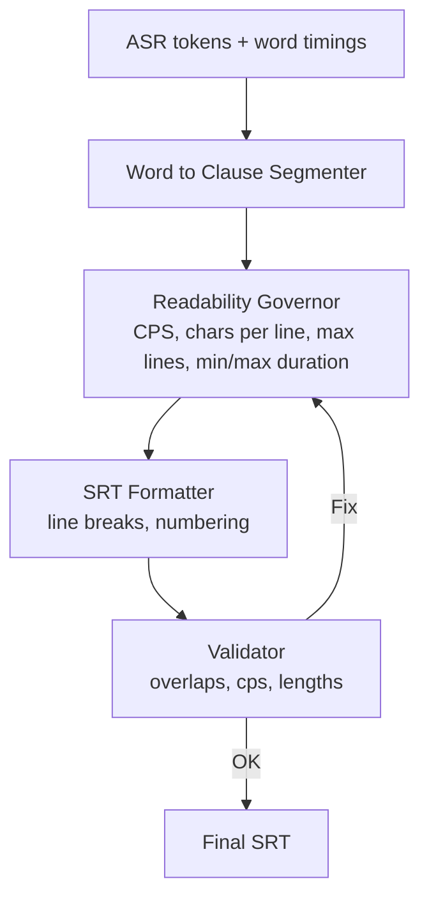
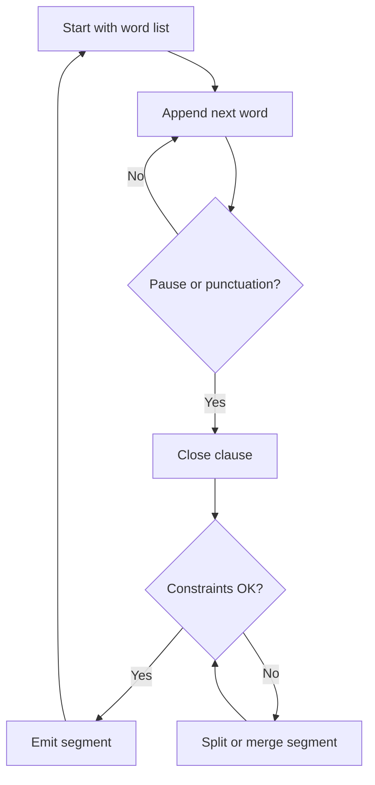

# Subtitle formatting and readability in the `parakeet_nemo_asr_rocm` ASR service

## Table of Contents

- [Introduction](#introduction)
- [Industry best‑practices for subtitle formatting](#industry-best-practices-for-subtitle-formatting)
- [Overview of subtitle formatting in `parakeet_nemo_asr_rocm`](#overview-of-subtitle-formatting-in-parakeet_nemo_asr_rocm)
  - [Configurable environment variables](#configurable-environment-variables)
  - [Segmentation logic for subtitle readability](#segmentation-logic-for-subtitle-readability)
    - [`split_lines(text: str) -> str`](#split_linestext-str---str)
    - [`_respect_limits(words: List[Word]) -> bool`](#_respect_limitswords-listword---bool)
    - [`_sentence_chunks(words)` and `_split_at_clause_boundaries(sentence)`](#_sentence_chunkswords-and-_split_at_clause_boundariessentence)
    - [`_merge_short_segments` and `_fix_overlaps`](#_merge_short_segments-and-_fix_overlaps)
    - [`segment_words(words)`](#segment_wordswords)
  - [SRT/VTT formatting](#srtvtt-formatting)
  - [Overall processing pipeline](#overall-processing-pipeline)
  - [Detailed segmentation flow](#detailed-segmentation-flow)
- [Applying this logic in other ASR codebases](#applying-this-logic-in-other-asr-codebases)
  - [1. Define configurable readability constraints](#1-define-configurable-readability-constraints)
  - [2. Represent words and segments with timing metadata](#2-represent-words-and-segments-with-timing-metadata)
  - [3. Implement a clause‑aware segmentation algorithm](#3-implement-a-clause-aware-segmentation-algorithm)
  - [4. Enforce reading speed and duration limits](#4-enforce-reading-speed-and-duration-limits)
  - [5. Provide modular formatters](#5-provide-modular-formatters)
  - [6. Integrate into the ASR pipeline](#6-integrate-into-the-asr-pipeline)
- [Conclusion](#conclusion)

## Introduction {#introduction}

The **parakeet‑nemo‑asr‑rocm** repository provides a containerised automatic‑speech‑recognition (ASR) service for NVIDIA’s **Parakeet‑TDT 0.6B v2** model running on AMD GPUs via ROCm. The tool includes a CLI, support for batch transcription and multiple output formats (TXT, SRT, VTT and JSON). A key feature is its intelligent segmentation and formatting logic that produces human‑readable subtitles and captions. The codebase uses configurable environment variables to enforce common subtitle‑readability constraints such as maximum characters per line, characters per second (CPS), line balancing and minimum/maximum display durations [GitHub](https://github.com/beecave-homelab/parakeet_nemo_asr_rocm/blob/main/project-overview.md#L163-L170). This report summarises industry best‑practices for subtitle formatting, describes how the repository implements them and outlines how any ASR codebase can adopt similar logic.

## Industry best‑practices for subtitle formatting

Research across subtitle style guides and industry articles yields common rules for readable captions:

|Aspect|Best‑practice|Evidence|
|---|---|---|
|**Characters per line**|Keep lines short; most platforms limit lines to ~42 characters. Netflix’s timed‑text style guide states _42 characters per line_ for most Latin languages[partnerhelp.netflixstudios.com](https://partnerhelp.netflixstudios.com/hc/en-us/articles/219375728-Timed-Text-Style-Guide-Subtitle-Templates#:~:text=5). VideoTap’s guidelines similarly suggest **32‑42 characters per line**[videotap.com](https://videotap.com/blog/subtitle-formatting-best-practices-and-standards#:~:text=Here%27s%20what%20you%20need%20to,know%20about%20subtitle%20formatting).|Netflix style guide[partnerhelp.netflixstudios.com](https://partnerhelp.netflixstudios.com/hc/en-us/articles/219375728-Timed-Text-Style-Guide-Subtitle-Templates#:~:text=5), VideoTap article[videotap.com](https://videotap.com/blog/subtitle-formatting-best-practices-and-standards#:~:text=Here%27s%20what%20you%20need%20to,know%20about%20subtitle%20formatting)|
|**Number of lines**|A subtitle block should contain at most **two lines**; text should remain on one line unless it exceeds the line‑length limit[partnerhelp.netflixstudios.com](https://partnerhelp.netflixstudios.com/hc/en-us/articles/219375728-Timed-Text-Style-Guide-Subtitle-Templates#:~:text=17).|Netflix line‑treatment section[partnerhelp.netflixstudios.com](https://partnerhelp.netflixstudios.com/hc/en-us/articles/219375728-Timed-Text-Style-Guide-Subtitle-Templates#:~:text=17)|
|**Line breaks**|When splitting into two lines, break at natural pauses: after punctuation and before conjunctions/prepositions[partnerhelp.netflixstudios.com](https://partnerhelp.netflixstudios.com/hc/en-us/articles/219375728-Timed-Text-Style-Guide-Subtitle-Templates#:~:text=,line%20break%20should%20not%20separate). Avoid splitting names or separating articles/adjectives from their nouns[partnerhelp.netflixstudios.com](https://partnerhelp.netflixstudios.com/hc/en-us/articles/219375728-Timed-Text-Style-Guide-Subtitle-Templates#:~:text=,auxiliary%2C%20reflexive%20pronoun%20or%20negation); VideoTap echoes this by recommending breaks at natural pauses[videotap.com](https://videotap.com/blog/subtitle-formatting-best-practices-and-standards#:~:text=4,breaks).|Netflix line‑treatment rules[partnerhelp.netflixstudios.com](https://partnerhelp.netflixstudios.com/hc/en-us/articles/219375728-Timed-Text-Style-Guide-Subtitle-Templates#:~:text=,auxiliary%2C%20reflexive%20pronoun%20or%20negation), VideoTap article[videotap.com](https://videotap.com/blog/subtitle-formatting-best-practices-and-standards#:~:text=4,breaks)|
|**Reading speed (CPS)**|Maintain an optimal characters‑per‑second range to ensure viewers can read comfortably. Netflix’s English guidelines allow **up to 17 cps for adult programmes and 15 cps for children**[partnerhelp.netflixstudios.com](https://partnerhelp.netflixstudios.com/hc/en-us/articles/219375728-Timed-Text-Style-Guide-Subtitle-Templates#:~:text=,such%20as%20R%26B%20or%20B%26B). Amara notes that a **12‑17 cps range** gives a smoother reading experience[blog.amara.org](https://blog.amara.org/2024/10/17/crafting-accessible-subtitles-the-critical-role-of-characters-per-second-cps/#:~:text=An%20optimal%20CPS%20rate%2C%20between,experience%20and%20improves%20overall%20accessibility). VideoTap suggests aiming for **~21 cps**[videotap.com](https://videotap.com/blog/subtitle-formatting-best-practices-and-standards#:~:text=%2A%20Character%20limits%3A%2032,per%20line%20for%20most%20platforms), although many broadcasters consider 17 cps safer.|Netflix reading‑speed limits[partnerhelp.netflixstudios.com](https://partnerhelp.netflixstudios.com/hc/en-us/articles/219375728-Timed-Text-Style-Guide-Subtitle-Templates#:~:text=,such%20as%20R%26B%20or%20B%26B), Amara article[blog.amara.org](https://blog.amara.org/2024/10/17/crafting-accessible-subtitles-the-critical-role-of-characters-per-second-cps/#:~:text=An%20optimal%20CPS%20rate%2C%20between,experience%20and%20improves%20overall%20accessibility), VideoTap guidelines[videotap.com](https://videotap.com/blog/subtitle-formatting-best-practices-and-standards#:~:text=Here%27s%20what%20you%20need%20to,know%20about%20subtitle%20formatting)|
|**Duration per subtitle**|Subtitles should stay on screen long enough to be readable but not linger too long. Netflix prescribes a **minimum duration of ~5/6 s (≈0.83 s) and maximum duration of 7 s**[partnerhelp.netflixstudios.com](https://partnerhelp.netflixstudios.com/hc/en-us/articles/219375728-Timed-Text-Style-Guide-Subtitle-Templates#:~:text=12). Many platforms keep maximum durations around 5–7 s.|Netflix timing guidelines[partnerhelp.netflixstudios.com](https://partnerhelp.netflixstudios.com/hc/en-us/articles/219375728-Timed-Text-Style-Guide-Subtitle-Templates#:~:text=12)|
|**Segmentation and clause‑based splitting**|Sentences that exceed limits should be segmented at clause boundaries (commas, semicolons, colons) to produce natural breaks[partnerhelp.netflixstudios.com](https://partnerhelp.netflixstudios.com/hc/en-us/articles/219375728-Timed-Text-Style-Guide-Subtitle-Templates#:~:text=25). Improper segmentation that splits sentences across subtitles or lines mid‑phrase should be avoided[partnerhelp.netflixstudios.com](https://partnerhelp.netflixstudios.com/hc/en-us/articles/219375728-Timed-Text-Style-Guide-Subtitle-Templates#:~:text=Subtitle%201%3A%C2%A0%20%C2%A0%20%C2%A0I%20don%27t,want%20to%20talk%20about%20it).|Netflix segmentation rules[partnerhelp.netflixstudios.com](https://partnerhelp.netflixstudios.com/hc/en-us/articles/219375728-Timed-Text-Style-Guide-Subtitle-Templates#:~:text=25)|
|**Minimum characters**|Very short fragments (e.g., single words) often create “orphan” subtitles that flash too quickly. Many style guides recommend merging short phrases into neighbouring segments.|Netflix segmentation guidelines[partnerhelp.netflixstudios.com](https://partnerhelp.netflixstudios.com/hc/en-us/articles/219375728-Timed-Text-Style-Guide-Subtitle-Templates#:~:text=25) and general readability references.|
|**Placement & appearance**|Subtitles should be centred at the bottom of the screen, use white sans‑serif text on a dark background and avoid heavy formatting[videotap.com](https://videotap.com/blog/subtitle-formatting-best-practices-and-standards#:~:text=Here%27s%20what%20you%20need%20to,know%20about%20subtitle%20formatting). While this is handled at the rendering stage rather than ASR formatting, it's important for completeness.|VideoTap guidelines[videotap.com](https://videotap.com/blog/subtitle-formatting-best-practices-and-standards#:~:text=Here%27s%20what%20you%20need%20to,know%20about%20subtitle%20formatting)|

These principles aim to balance legibility and comprehension while respecting timing constraints.

## Overview of subtitle formatting in `parakeet_nemo_asr_rocm`

### Configurable environment variables

The repository centralises readability constraints in its constants module and `.env.example` file. When the project starts, a helper loads the `.env` file so that downstream imports pick up user‑defined values[GitHub](https://github.com/beecave-homelab/parakeet_nemo_asr_rocm/blob/main/parakeet_nemo_asr_rocm/utils/env_loader.py#L31-L61). Default values align with industry standards and can be overridden via environment variables:

|Variable|Purpose|Default / Example value|
|---|---|---|
|`MAX_CPS` and `MIN_CPS`|Maximum and minimum characters per second for subtitle readability; used to compute reading speed and decide segment merges[GitHub](https://github.com/beecave-homelab/parakeet_nemo_asr_rocm/blob/main/parakeet_nemo_asr_rocm/utils/constant.py#L36-L45).|Default `MAX_CPS=17`, `MIN_CPS=12`[GitHub](https://github.com/beecave-homelab/parakeet_nemo_asr_rocm/blob/main/parakeet_nemo_asr_rocm/utils/constant.py#L36-L45). The `.env.example` suggests `MAX_CPS=14` and `MIN_CPS=12` for conservative pacing[GitHub](https://github.com/beecave-homelab/parakeet_nemo_asr_rocm/blob/main/.env.example#L20-L25).|
|`MAX_LINE_CHARS` and `MAX_LINES_PER_BLOCK`|Maximum characters per line and lines per subtitle block[GitHub](https://github.com/beecave-homelab/parakeet_nemo_asr_rocm/blob/main/parakeet_nemo_asr_rocm/utils/constant.py#L43-L45).|Default `MAX_LINE_CHARS=42` (matching Netflix) and `MAX_LINES_PER_BLOCK=2`[GitHub](https://github.com/beecave-homelab/parakeet_nemo_asr_rocm/blob/main/parakeet_nemo_asr_rocm/utils/constant.py#L43-L45); `.env.example` allows 3 lines for flexibility[GitHub](https://github.com/beecave-homelab/parakeet_nemo_asr_rocm/blob/main/.env.example#L27-L29).|
|`MAX_BLOCK_CHARS` and `MAX_BLOCK_CHARS_SOFT`|Hard and soft character limits for a whole subtitle block (often 2 lines)[GitHub](https://github.com/beecave-homelab/parakeet_nemo_asr_rocm/blob/main/parakeet_nemo_asr_rocm/utils/constant.py#L73-L82). Soft limit allows slight overflow when merging segments.|Hard limit defaults to `2 × MAX_LINE_CHARS` (e.g., 84 characters)[GitHub](https://github.com/beecave-homelab/parakeet_nemo_asr_rocm/blob/main/parakeet_nemo_asr_rocm/utils/constant.py#L73-L80); soft limit defaults to 90 characters[GitHub](https://github.com/beecave-homelab/parakeet_nemo_asr_rocm/blob/main/parakeet_nemo_asr_rocm/utils/constant.py#L81-L82).|
|`MIN_SEGMENT_DURATION_SEC` and `MAX_SEGMENT_DURATION_SEC`|Minimum and maximum display durations for subtitle segments[GitHub](https://github.com/beecave-homelab/parakeet_nemo_asr_rocm/blob/main/parakeet_nemo_asr_rocm/utils/constant.py#L48-L52).|Default minimum 1.2 s and maximum 5.5 s[GitHub](https://github.com/beecave-homelab/parakeet_nemo_asr_rocm/blob/main/parakeet_nemo_asr_rocm/utils/constant.py#L48-L52); `.env.example` recommends 1.5 s and 6 s[GitHub](https://github.com/beecave-homelab/parakeet_nemo_asr_rocm/blob/main/.env.example#L34-L38).|
|`DISPLAY_BUFFER_SEC`|Additional buffer after the last word in a segment to ensure comfortable reading[GitHub](https://github.com/beecave-homelab/parakeet_nemo_asr_rocm/blob/main/parakeet_nemo_asr_rocm/utils/constant.py#L45-L48).|0.2 s[GitHub](https://github.com/beecave-homelab/parakeet_nemo_asr_rocm/blob/main/parakeet_nemo_asr_rocm/utils/constant.py#L45-L48).|
|`SOFT_BOUNDARY_WORDS` & `INTERJECTION_WHITELIST`|Lists of conjunctions (e.g., “and”, “but”, “that”) and interjections (e.g., “wow”, “oh”) used to influence splitting and merging decisions[GitHub](https://github.com/beecave-homelab/parakeet_nemo_asr_rocm/blob/main/parakeet_nemo_asr_rocm/utils/constant.py#L59-L71).|Provided lists in `.env.example`[GitHub](https://github.com/beecave-homelab/parakeet_nemo_asr_rocm/blob/main/.env.example#L45-L48).|

These variables allow developers to tune subtitle generation for different languages or platform requirements. The values mirror the best‑practices summarised above.

### Segmentation logic for subtitle readability

The segmentation algorithm converts a list of `Word` objects (produced by the ASR model) into `Segment` objects representing caption blocks. The algorithm is implemented in `timestamps/segmentation.py` and follows a **sentence‑first, clause‑aware** strategy[GitHub](https://github.com/beecave-homelab/parakeet_nemo_asr_rocm/blob/main/parakeet_nemo_asr_rocm/timestamps/segmentation.py#L371-L379). Key functions include:

#### `split_lines(text: str) -> str`

The `split_lines` function splits a caption’s text into one or two lines while respecting the `MAX_LINE_CHARS` limit[GitHub](https://github.com/beecave-homelab/parakeet_nemo_asr_rocm/blob/main/parakeet_nemo_asr_rocm/timestamps/segmentation.py#L256-L301). It prefers a balanced break where both lines are within the limit and rejects splits that result in very short lines (<25% of the limit or <10 characters)[GitHub](https://github.com/beecave-homelab/parakeet_nemo_asr_rocm/blob/main/parakeet_nemo_asr_rocm/timestamps/segmentation.py#L261-L285). If no balanced break is found, it falls back to a greedy split just before the limit[GitHub](https://github.com/beecave-homelab/parakeet_nemo_asr_rocm/blob/main/parakeet_nemo_asr_rocm/timestamps/segmentation.py#L292-L300).

#### `_respect_limits(words: List[Word]) -> bool`

This helper checks whether a list of words obeys character, duration and CPS limits. It computes the plain text, character count, duration and characters per second, and compares them with the environment‑based limits[GitHub](https://github.com/beecave-homelab/parakeet_nemo_asr_rocm/blob/main/parakeet_nemo_asr_rocm/timestamps/segmentation.py#L304-L315). When merging segments, a soft character limit (`MAX_BLOCK_CHARS_SOFT`) allows slight overflow to favour fluent sentences[GitHub](https://github.com/beecave-homelab/parakeet_nemo_asr_rocm/blob/main/parakeet_nemo_asr_rocm/timestamps/segmentation.py#L304-L315).

#### `_sentence_chunks(words)` and `_split_at_clause_boundaries(sentence)`

Sentences are initially detected by splitting on strong punctuation (periods, exclamation marks and question marks)[GitHub](https://github.com/beecave-homelab/parakeet_nemo_asr_rocm/blob/main/parakeet_nemo_asr_rocm/timestamps/segmentation.py#L318-L343). For sentences that violate hard limits (too long or too fast), the algorithm splits at clause boundaries—commas, semicolons and colons—using backtracking to find the most balanced break[GitHub](https://github.com/beecave-homelab/parakeet_nemo_asr_rocm/blob/main/parakeet_nemo_asr_rocm/timestamps/segmentation.py#L115-L161). If no suitable clause boundary exists, a greedy fallback groups words while staying within limits.【26044046694219†L170-L299】

#### `_merge_short_segments` and `_fix_overlaps`

Very short segments (duration below `MIN_SEGMENT_DURATION_SEC` or <15 characters) are merged with the following segment if the combined result still satisfies the hard limits[GitHub](https://github.com/beecave-homelab/parakeet_nemo_asr_rocm/blob/main/parakeet_nemo_asr_rocm/timestamps/segmentation.py#L63-L106). After segmentation, overlapping segments are trimmed or merged to ensure monotonically increasing timestamps[GitHub](https://github.com/beecave-homelab/parakeet_nemo_asr_rocm/blob/main/parakeet_nemo_asr_rocm/timestamps/segmentation.py#L27-L60).

#### `segment_words(words)`

This function orchestrates the full segmentation process. It splits words into sentences, fixes overly long sentences via clause splitting or greedy fallback, eliminates orphan words, merges adjacent sentences within soft limits, then converts them into `Segment` objects with computed start/end times[GitHub](https://github.com/beecave-homelab/parakeet_nemo_asr_rocm/blob/main/parakeet_nemo_asr_rocm/timestamps/segmentation.py#L371-L445).

The segmentation algorithm ensures that each caption block satisfies characters‑per‑line, block‑length and reading‑speed constraints while favouring natural linguistic breaks.

### SRT/VTT formatting

Once segments are generated, formatter functions convert them into the desired output format. The SRT formatter iterates through segments, numbers them sequentially, formats the start/end timestamps as `HH:MM:SS,ms` and writes each caption text on separate lines[GitHub](https://github.com/beecave-homelab/parakeet_nemo_asr_rocm/blob/main/parakeet_nemo_asr_rocm/formatting/_srt.py#L27-L40). If the `--highlight-words` option is used, each word is wrapped in emphasis tags (e.g., `<b>`). The VTT formatter uses a similar approach but outputs `HH:MM:SS.ms` timestamps and includes a `WEBVTT` header[GitHub](https://github.com/beecave-homelab/parakeet_nemo_asr_rocm/blob/main/parakeet_nemo_asr_rocm/formatting/_vtt.py#L27-L40). A TXT formatter concatenates segment texts with spaces for plain transcripts[GitHub](https://github.com/beecave-homelab/parakeet_nemo_asr_rocm/blob/main/parakeet_nemo_asr_rocm/formatting/_txt.py#L6-L16).

### Overall processing pipeline

The transcription flow in `transcribe.py` orchestrates the ASR model, segmentation and formatting:

1. **Audio loading and chunking:** audio files are loaded and split into chunks based on `chunk_len_sec`. Each chunk is transcribed with the Parakeet‑TDT model, optionally returning word‑level timestamps[GitHub](https://github.com/beecave-homelab/parakeet_nemo_asr_rocm/blob/main/parakeet_nemo_asr_rocm/transcribe.py#L311-L392).

2. **Merging overlapping chunks:** for long audio, overlapping chunks are merged via either a contiguous or longest‑common‑subsequence strategy. Duplicate words are removed and segments are rebuilt using `segment_words`[GitHub](https://github.com/beecave-homelab/parakeet_nemo_asr_rocm/blob/main/parakeet_nemo_asr_rocm/transcribe.py#L416-L471).

3. **Formatting:** the appropriate formatter (TXT, JSON, SRT, VTT) is selected via a registry[GitHub](https://github.com/beecave-homelab/parakeet_nemo_asr_rocm/blob/main/parakeet_nemo_asr_rocm/formatting/__init__.py#L19-L50). For SRT and VTT, the aligned `Segment` objects are passed to the formatter to produce the final subtitle text[GitHub](https://github.com/beecave-homelab/parakeet_nemo_asr_rocm/blob/main/parakeet_nemo_asr_rocm/transcribe.py#L618-L622). Output files are written to the specified directory with unique names[GitHub](https://github.com/beecave-homelab/parakeet_nemo_asr_rocm/blob/main/parakeet_nemo_asr_rocm/transcribe.py#L624-L636).

The diagram below summarises the high‑level data flow:

`flowchart TD     A[Audio file(s)] --> B[Segment audio into chunks]     B --> C[Transcribe chunks with Parakeet model]     C --> D{Word timestamps?}     D -- yes --> E[Extract word timestamps]     E --> F[Merge overlapping chunks]     F --> G[Segment words into readable caption blocks]     D -- no --> G     G --> H[Format segments (SRT/VTT/TXT/JSON)]     H --> I[Write output file]`

### Detailed segmentation flow

The segmentation algorithm’s internal operations can be depicted as follows:

### data flow

### Clause-aware segmentation logic (high-level)

## Applying this logic in other ASR codebases {#applying-this-logic-in-other-asr-codebases}

To implement high‑quality subtitle formatting in any ASR pipeline, follow these guidelines:

### 1. Define configurable readability constraints

Create a configuration module that loads environment variables for parameters such as maximum characters per line, maximum characters per second, maximum lines per block, minimum/maximum subtitle durations and soft boundaries. Use sensible defaults drawn from industry guidelines: e.g., `MAX_LINE_CHARS=42`[GitHub](https://github.com/beecave-homelab/parakeet_nemo_asr_rocm/blob/main/parakeet_nemo_asr_rocm/utils/constant.py#L43-L45), `MAX_CPS=17`[GitHub](https://github.com/beecave-homelab/parakeet_nemo_asr_rocm/blob/main/parakeet_nemo_asr_rocm/utils/constant.py#L36-L39), `MIN_CPS=12`[GitHub](https://github.com/beecave-homelab/parakeet_nemo_asr_rocm/blob/main/parakeet_nemo_asr_rocm/utils/constant.py#L40-L42), `MAX_LINES_PER_BLOCK=2`[GitHub](https://github.com/beecave-homelab/parakeet_nemo_asr_rocm/blob/main/parakeet_nemo_asr_rocm/utils/constant.py#L43-L45), `MIN_SEGMENT_DURATION_SEC=1.2`[GitHub](https://github.com/beecave-homelab/parakeet_nemo_asr_rocm/blob/main/parakeet_nemo_asr_rocm/utils/constant.py#L48-L52) and `MAX_SEGMENT_DURATION_SEC=5.5`[GitHub](https://github.com/beecave-homelab/parakeet_nemo_asr_rocm/blob/main/parakeet_nemo_asr_rocm/utils/constant.py#L48-L50). Expose these values via environment variables so that deployments can adapt to language‑specific rules.

### 2. Represent words and segments with timing metadata

Define data models for `Word` (text, start, end, optional score) and `Segment` (text with line breaks, list of words, start, end). An `AlignedResult` class can hold the list of segments and a flat list of all words[GitHub](https://github.com/beecave-homelab/parakeet_nemo_asr_rocm/blob/main/parakeet_nemo_asr_rocm/timestamps/models.py#L31-L47). Use your ASR model or external tools to produce word‑level timestamps; this may require heuristics such as detecting word boundaries from tokenisation markers (e.g., leading “▁” in SentencePiece)[GitHub](https://github.com/beecave-homelab/parakeet_nemo_asr_rocm/blob/main/parakeet_nemo_asr_rocm/timestamps/word_timestamps.py#L51-L67).

### 3. Implement a clause‑aware segmentation algorithm

Use a sentence‑first approach: split the word list into sentences based on strong punctuation. Then enforce hard limits (character count, duration, CPS) and split further at clause boundaries if limits are violated[GitHub](https://github.com/beecave-homelab/parakeet_nemo_asr_rocm/blob/main/parakeet_nemo_asr_rocm/timestamps/segmentation.py#L371-L400). Use backtracking to find balanced splits and fall back to greedy grouping when necessary[GitHub](https://github.com/beecave-homelab/parakeet_nemo_asr_rocm/blob/main/parakeet_nemo_asr_rocm/timestamps/segmentation.py#L115-L169). Merge very short segments with their neighbours to avoid orphan captions[GitHub](https://github.com/beecave-homelab/parakeet_nemo_asr_rocm/blob/main/parakeet_nemo_asr_rocm/timestamps/segmentation.py#L63-L106) and ensure timestamps are strictly monotonic[GitHub](https://github.com/beecave-homelab/parakeet_nemo_asr_rocm/blob/main/parakeet_nemo_asr_rocm/timestamps/segmentation.py#L27-L60). Insert line breaks within a caption using a balanced split algorithm like `split_lines`[GitHub](https://github.com/beecave-homelab/parakeet_nemo_asr_rocm/blob/main/parakeet_nemo_asr_rocm/timestamps/segmentation.py#L256-L301).

### 4. Enforce reading speed and duration limits

During segmentation and merging, compute characters per second (`cps`) by dividing the plain text length by the duration of the candidate segment. Reject or split segments whose CPS exceeds `MAX_CPS`[GitHub](https://github.com/beecave-homelab/parakeet_nemo_asr_rocm/blob/main/parakeet_nemo_asr_rocm/timestamps/segmentation.py#L304-L315) and avoid segments that are shorter than `MIN_SEGMENT_DURATION_SEC` or longer than `MAX_SEGMENT_DURATION_SEC`[GitHub](https://github.com/beecave-homelab/parakeet_nemo_asr_rocm/blob/main/parakeet_nemo_asr_rocm/utils/constant.py#L48-L52). Provide a trailing buffer after each segment (`DISPLAY_BUFFER_SEC`) to prevent immediate cut‑offs and improve readability[GitHub](https://github.com/beecave-homelab/parakeet_nemo_asr_rocm/blob/main/parakeet_nemo_asr_rocm/utils/constant.py#L45-L48).

### 5. Provide modular formatters

Create separate functions to convert `AlignedResult` objects into various output formats. For SRT, number each segment, format timestamps as `HH:MM:SS,ms` and join lines with blank lines[GitHub](https://github.com/beecave-homelab/parakeet_nemo_asr_rocm/blob/main/parakeet_nemo_asr_rocm/formatting/_srt.py#L27-L40). For VTT, include a `WEBVTT` header and use dot‑separated timestamps[GitHub](https://github.com/beecave-homelab/parakeet_nemo_asr_rocm/blob/main/parakeet_nemo_asr_rocm/formatting/_vtt.py#L27-L40). For plain text, join segments with spaces[GitHub](https://github.com/beecave-homelab/parakeet_nemo_asr_rocm/blob/main/parakeet_nemo_asr_rocm/formatting/_txt.py#L6-L16). Register formatters in a dictionary and allow selecting them via CLI or API to simplify extension to additional formats[GitHub](https://github.com/beecave-homelab/parakeet_nemo_asr_rocm/blob/main/parakeet_nemo_asr_rocm/formatting/__init__.py#L19-L50).

### 6. Integrate into the ASR pipeline

Ensure that the segmentation and formatting logic is invoked after transcription and (optionally) after merging overlapping chunks. If the ASR pipeline supports streaming, process segments incrementally with short pseudo‑streaming chunks; merge them using strategies like longest‑common‑subsequence to avoid duplicated words[GitHub](https://github.com/beecave-homelab/parakeet_nemo_asr_rocm/blob/main/parakeet_nemo_asr_rocm/transcribe.py#L416-L471). Expose CLI options to control output format, batch size, chunk length, overlap duration, word‑timestamps and highlight options so users can customise performance and output[GitHub](https://github.com/beecave-homelab/parakeet_nemo_asr_rocm/blob/main/README.md#L166-L176).

## Conclusion

The `parakeet_nemo_asr_rocm` project demonstrates a robust approach to generating readable subtitles directly from ASR output. By externalising readability parameters into environment variables, employing a clause‑aware segmentation algorithm and providing modular formatters, the codebase adheres to widely accepted subtitle standards and offers flexibility for different languages and platforms. Any ASR service seeking to produce high‑quality subtitles should adopt similar practices: define configurable constraints aligned with industry guidelines, accurately compute word‑level timings, implement intelligent segmentation that respects CPS and line‑length limits, and produce multiple subtitle formats via dedicated formatters.

This report explores industry best practices for subtitle formatting and readability, and shows how the `parakeet_nemo_asr_rocm` ASR service implements these practices through environment-based configuration, clause-aware segmentation, and modular formatters. The report provides guidance for any ASR codebase to adopt similar methods, with diagrams illustrating the processing pipeline and segmentation logic.

---
